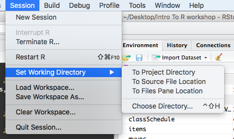

# (PART\*) Session I {.unnumbered}

# Introduction to R and RStudio

```{r, include = FALSE}
knitr::opts_chunk$set(fig.width=6, fig.height=3.5, fig.align="center")
```

The next two chapters will provide you with a hands on opportunity to
learn R and RStudio. While R is a big topic and we will not be able to
cover everything, by the end of this session we hope that you will feel
comfortable starting to use R on your own.

## Learning Objectives

-   Understand the value of learning R
-   Navigate RStudio
-   Define terms: object, function, argument, package, vector, data
    frame.
-   Use help documentation in RStudio.

## Why learn R?

-   **R is free, open-source, and cross-platform.** Anyone can inspect
    the source code to see how R works. Because of this transparency,
    there is less chance for mistakes, and if you (or someone else) find
    some, you can report and fix bugs. Because R is open source and is
    supported by a large community of developers and users, there is a
    very large selection of third-party add-on packages which are freely
    available to extend R's native capabilities.

-   **R code is great for reproducibility**. Reproducibility is when
    someone else (including your future self) can obtain the same
    results from the same dataset when using the same analysis. R
    integrates with other tools to generate manuscripts from your code.
    If you collect more data, or fix a mistake in your dataset, the
    figures and the statistical tests in your manuscript are updated
    automatically.

-   **R relies on a series of written commands, not on remembering a
    succession of pointing and clicking.** If you want to redo your
    analysis because you collected more data, you don't have to remember
    which button you clicked in which order to obtain your results; you
    just have to run your script again.

-   **R is interdisciplinary and extensible** With 10,000+ packages that
    can be installed to extend its capabilities, R provides a framework
    that allows you to combine statistical approaches from many
    scientific disciplines to best suit the analytical framework you
    need to analyze your data. For instance, R has packages for image
    analysis, GIS, time series, population genetics, and a lot more.

-   **R works on data of all shapes and sizes.** The skills you learn
    with R scale easily with the size of your dataset. Whether your
    dataset has hundreds or millions of lines, it won't make much
    difference to you. R is designed for data analysis. It comes with
    special data structures and data types that make handling of missing
    data and statistical factors convenient. R can connect to
    spreadsheets, databases, and many other data formats, on your
    computer or on the web.

-   **R produces high-quality graphics.** The plotting functionalities
    in R are endless, and allow you to adjust any aspect of your graph
    to convey most effectively the message from your data.

-   **R has a large and welcoming community.** Thousands of people use R
    daily. Many of them are willing to help you through mailing lists
    and websites such as [Stack Overflow](https://stackoverflow.com/),
    or on the [RStudio community](https://community.rstudio.com/).
    Questions which are backed up with [short, reproducible code
    snippets](https://www.tidyverse.org/help/) are more likely to
    attract knowledgeable responses.

## Starting out in R

[R](https://cran.rstudio.com/) is both a programming language and an
interactive environment for data exploration and statistics.

Working with R is primarily text-based. The basic mode of use for R is
that the user provides commands in the R language and then R computes
and displays the result.

### Downloading, Installing and Running R

**Download**\
R can be downloaded from [CRAN (The Comprehensive R Archive
Network)](https://cran.rstudio.com/index.html) for Windows, Linux, or
Mac.

**Install**\
Installation of R is like most software packages and you will be guided.
Should you have any issues or need help you can refer to [R Installation
and
Administration](https://cran.r-project.org/doc/manuals/r-release/R-admin.html)

**Running**\
R can be launched from your software or applications launcher or When
working at a command line on UNIX or Windows, the command `R` can be
used for starting the main R program in the form `R`

You will see a console similar to this appear:

```{r echo=F}
knitr::include_graphics("images/console.png")
```

While it is possible to work solely through the console or using a
command line interface, the ideal environment to work in R is RStudio.

### RStudio

[RStudio](https://www.rstudio.com/products/rstudio/download/) is a user interface for working with R. It is called an Integrated Development Environment (IDE): a piece of software that provides tools to make programming easier. RStudio acts as a sort of wrapper around the R language. You can use R without RStudio, but it’s much more limiting. RStudio makes it easier to import datasets, create and write scripts, and makes using R much more effective. RStudio is also free and open source. To function correctly, RStudio needs R and therefore both need to be installed on your computer. But for this class we'll be using a browser based version called RStudio Cloud (see directions in the [RStudio Cloud] section below.)

RStudio is divided into four "panes". The placement of these panes and
their content can be customized (see menu, Tools -\> Global Options -\>
Pane Layout).

The Default Layout is:

-   Top Left - **Source**: your scripts and documents
-   Bottom Left - **Console**: what R would look and be like without
    RStudio
-   Top Right - **Environment/History**: look here to see what you have
    done
-   Bottom Right - **Files** and more: see the contents of the
    project/working directory here, like your Script.R file

```{r echo=F}
knitr::include_graphics("images/rstudio.png")
```

### RStudio Cloud

RStudio Cloud is a browser-based version of RStudio. It will allow you
to use RStudio without needing to download anything to your computer.
You can also easily share your R projects with others. While we
recommend downloading RStudio for regular use, we will be using RStudio
Cloud for these workshops so we can easily share files and packages with
you.

Get Started:

1.  Create your free RStudio Cloud account at
    <https://rstudio.cloud/plans/free>.
2.  Go to the class project <https://rstudio.cloud/content/4241048>
3.  Note the text that marks this as a Temporary Copy. Select the
    `Save a Permanent Copy` button to begin working!

## Using this book

**For these instructions code will appear in the gray box as follows:**

    fake code

To run the code you can copy and paste the code and run it in your
RStudio session console at the prompt `>` which looks like a greater
than symbol.

    > fake code

The code can also be added to an R Script to be run.

When the code is run in RStudio the console prints out results like so:

    [1] Result

In this tutorial results from code will appear like so:

    ## [1] Result

## Working in the Console

The console is an interactive environment for RStudio, click on the
"Console" pane, type `3 + 3` and press enter. R displays the result of
the calculation.

```{r class.source = "source", class.output = "output"}
3 + 3
```

`+` is called an operator. R has the operators you would expect for for
basic mathematics:

**Arithmetic operators**<br>

| operator | meaning    |
|:---------|:-----------|
| \+       | plus       |
| \-       | minus      |
| \*       | times      |
| /        | divided by |
| \^       | exponent   |

**Logical Operators**<br>

| operator | meaning                  |
|:---------|:-------------------------|
| ==       | exactly equal            |
| !=       | not equal to             |
| \<       | less than                |
| \<=      | less than or equal to    |
| \>       | greater than             |
| \>=      | greater than or equal to |
| x\|y     | x or y                   |
| x&y      | x and y                  |
| !x       | not x                    |

Spaces can be used to make code easier to read.

```{r}
2 * 2 == 4
```

## Objects

### Creating Objects

When you have certain values, data, plots, etc that you want to work
with You can create objects (make assignments) in R with the assignment
operator `<-`:

All R statements where you create objects, assignment statements, have
the same form:

    object_name <- value

When reading that code say "object name gets value" in your head.

```{r}
x <- 3 * 4

x
```

Once you have an object you can do other calculations with it.

```{r}
x * x
```

::: {.shaded .tip data-latex=""}
**Objects vs. Variables**<br> What are known as objects in R are known
as variables in many other programming languages. Depending on the
context, object and variable can have drastically different meanings.
However, in this lesson, the two words are used synonymously. For more
information see:
<https://cran.r-project.org/doc/manuals/r-release/R-lang.html#Objects>
:::

### Working with Objects

That last example was kind of abstract. So let's look at a more
practical example.

Let's do some calculations with the population of Maryland [^rbasics-1].
First we can save the population number to an object. We will call it
`md_pop` because that is short, descriptive, and easy to remember.

[^rbasics-1]: Population data from
    <https://www.census.gov/quickfacts/MD>

```{r}
md_pop <- 6165129
```

What percentage of the Maryland population is over 18? According to the
Census Bureau [^rbasics-2], 78% of the Maryland population is over 18.
We can use that to calculate the number of adults in Maryland.

[^rbasics-2]: Population data from
    <https://www.census.gov/quickfacts/MD>

```{r}
md_adult_pop <- .78 * md_pop
```

Next, we want to know what percentage of people in Maryland have been
fully vaccinated for COVID-19. As of early July 2022 4.68 million people
of all ages have been vaccinated in Maryland [^rbasics-3]. So let's
create another object:

[^rbasics-3]: Vaccination information from
    <https://coronavirus.maryland.gov/#Vaccine>

```{r}
md_vax_pop <- 4682799
```

Now we can calculate the percentage of the Maryland population that is
vaccinated.

```{r}
percent_vax <- (md_vax_pop / md_pop) * 100
percent_vax
```

As more people get vaccinated this can be updated. Let's say later in
year we have 4.9 million Marylanders who are fully vaccinated. We can
re-assign the value of `md_vax_pop`

```{r}
md_vax_pop <- 4900000
```

Then recalculate `percent_vax`

```{r}
percent_vax <- (md_vax_pop / md_pop) * 100
percent_vax
```

::: {.shaded .tip data-latex=""}
**Tip**<br> You will make lots of assignments and `<-` is a pain to
type. Avoid the temptation to use `=`: it will work, but it will cause
confusion later. Instead, use RStudio's keyboard shortcut:
<kbd>`Alt + -`</kbd> (the minus sign).

Notice that RStudio automagically surrounds `<-` with spaces, which is a
good code formatting practice. Code is miserable to read on a good day,
so giveyoureyesabreak and use spaces.
:::

### Naming Objects

The name for objects must start with a letter, and can only contain
letters, numbers, underscores (`_`)and periods (`.`). The name of the
object should describe what is being assigned so they typically will be
multiple words. One convention used is **snake_case** where lowercase
words are separated with `_`. Another popular style is **camelCase**
where compound words or phrases are written so that each word or
abbreviation in the middle of the phrase begins with a capital letter,
with no intervening spaces or punctuation and the first letter is
lowercase.

```
    thisIsCamelCase
    some_use_snake_case
    others.use.periods                  #avoid
    Others_pRefer.to_RENOUNCEconvention #avoid

```

### Challenge

::: {.shaded .question data-latex=""}
**Question** <br> Earlier you created an object called `md_adult_pop`
which used Census data to calculate the number of adults living in
Maryland. According to the CDC^[Centers for Disease Control and Prevention. COVID Data Tracker. Atlanta, GA: US Department of Health and Human Services, CDC; 2022, July 06. https://covid.cdc.gov/covid-data-tracker], 4040544 adults in Maryland have been
fully vaccinated against COVID-19.

1. Assign the number of fully
vaccinated adults in Maryland to a new object. 
2. Use the new object
together with `md_adult_pop` to calculate the percentage of adults in
Maryland who are fully vaccinated. Save this to an object called
`md_adult_percent_vax`.
:::

## Saving code in an R script

It might seem like you could just as easily calculate the percentage of
vaccinated Marylanders by hand. But what if you had to do it again and
again, multiple times a day, for days on end? What if you had to make
sure multiple people on your team could perform the same task?

This is where the real strength of R as a programming language comes in.
You can save all the steps of your analysis to a *script*. This is
especially powerful if you have long and complicated analyses. It is how
R contributes to reproducible and open science.

If working in the RStudio Cloud project, open the file vax_count.R (or [download the file](https://osf.io/download/kz57p/) if working locally). Here we have recorded the steps we just took.
So let's say you were training a new employee to run this very important
analysis. Now all they have to do is input the new vaccination number,
and run the script.

The usual workflow is to save your code in an R script (".R file"). Go
to "File/New File/R Script" to create a new R script. Code in your R
script can be sent to the console by selecting it or placing the cursor
on the correct line, and then pressing **Control-Enter**
(**Command-Enter** on a Mac).

::: {.shaded .tip data-latex=""}
**Tip**<br> Add comments to code, using lines starting with the `#`
character. This makes it easier for others to follow what the code is
doing (and also for us the next time we come back to it).
:::

## Setting your Working Directory

The working directory is the location within which R points to the files
system. RStudio sets up a default working directory, typically the home
directory of the computer, which can be changed in the global options
setting in RStudio.

In the code samples provided the data files are located in the R working
directory, which can be found with the function `getwd`.

    getwd() # get current working directory

You can select a different working directory with the function
`setwd()`, and thus avoid entering the full path of the data files.

    setwd("<new path>")   # set working directory

Note that the forward slash should be used as the path separator even on
Windows platform.

    setwd("C:/MyDoc")

Alternatively you can go to the working directory and set the working
directory using the files panel and clicking the gear wheel for "more"
within RStudio.

```{r echo=F}
knitr::include_graphics("images/workingDir01.png")
```

Or by selecting the drop down list found in Tools(Windows) or
Session(Mac) in the menu at the top of the RStudio window.

```{r echo=F}

```

## Functions and their arguments

Functions are "canned scripts" that automate more complicated sets of
commands including operations assignments, etc. Many functions are
predefined, or can be made available by importing R *packages* (more on
that later). A function usually gets one or more inputs called
*arguments*. Functions often (but not always) return a *value*.

A typical example would be the function `round()`. The input (the
argument) must be a number, and the return value (in fact, the output)
is that number rounded to the nearest whole number. Executing a function
('running it') is called *calling* the function. You can save the output
of a function to an object. The format would look like:

```{r, eval=FALSE, purl=FALSE}
b <- round(a)
```

Here, the value of `a` is given to the `round()` function, the `round()`
function rounds the number, and returns the value which is then assigned
to the object `b`.

The return 'value' of a function need not be numerical (like that of
`sqrt()`), and it also does not need to be a single item: it can be a
set of things, or even a dataset. We'll see that when we read data files
into R.

Arguments can be anything, not only numbers or filenames, but also other
objects. Exactly what each argument means differs per function, and must
be looked up in the documentation (see below). Some functions take
arguments which may either be specified by the user, or, if left out,
take on a *default* value: these are called *options*. Options are
typically used to alter the way the function operates, such as whether
it ignores 'bad values', or what symbol to use in a plot. However, if
you want something specific, you can specify a value of your choice
which will be used instead of the default.

`round()` only needs one argument, a number, or object that is storing a
numerical value.

```{r, results='show', purl=FALSE}
round(percent_vax)
```

Here, we've called `round()` on our percent_vax object and it returned
`r round(percent_vax)`. That's because the default action of the
function is to round to the nearest whole number. If we want more digits
we can see how to do that by getting information about the `round`
function. We can use `args(round)` or look at the help for this function
using `?round`.

```{r, results='show', purl=FALSE}
args(round)
```

We see that if we want a different number of digits, we can type
`digits=2` or however many we want.

```{r, results='show', purl=FALSE}
round(percent_vax, digits = 2)
```

If you provide the arguments in the exact same order as they are defined
you don't have to name them:

```{r, results='show', purl=FALSE}
round(percent_vax, 2)
```

And if you do name the arguments, you can switch their order:

```{r, results='show', purl=FALSE}
round(digits = 2, x = percent_vax)
```

It's good practice to put the non-optional arguments (like the number
you're rounding) first in your function call, and to specify the names
of all optional arguments. If you don't, someone reading your code might
have to look up the definition of a function with unfamiliar arguments
to understand what you're doing.

### Getting Help

In the previous example we looked up the arguments to `round()` using
`args(round)` alternatively we couldve looked at the help page for
`round()` to find this out with `?round`. To get help about a particular
package or function you can access the help pane in RStudio and type its
name in the search box.

```{r echo=F,out.width="80%"}
knitr::include_graphics("images/help.png")
```

The `help()` function and `?` help operator in R provide access to the
documentation pages for R functions, data sets, and other objects, both
for packages in the standard R distribution and for contributed
packages. To do so type as follows

    help({function})
    help(package = {package name})

    ?{function}
    ?"{package name}"

### Challenge: using functions

::: {.shaded .question data-latex=""}
**Questions** <br>

Look at the documentation for the `seq` function. What does `seq` do?
Give an example of using `seq` with either the `by` or `length.out`
argument.
:::

## Packages

While you can write your own functions, most functions you use will be
part of a package. In R, the fundamental unit of shareable code is the
package. A package bundles together code, data, documentation, and
tests, and is easy to share with others. As of July 2018, there were
over 14,000 packages available on the Comprehensive R Archive Network,
or CRAN, the public clearing house for R packages. This huge variety of
packages is one of the reasons that R is so successful.

Installing a package using RStudio requires selecting the Install
Packages Button in the Files, Plots, Packages Pane

```{r echo=F, out.width="75%"}
knitr::include_graphics("images/installPackages.png")
```

In the pop up box that results simply type the name of the package and
check "install dependencies" and click Install

```{r echo=F,out.width="100%"}
knitr::include_graphics("images/packagesDialog.png")
```

Its also possible for you to install and load packages from the console.
Always make sure to put the package name in quotes when installing and
setting `dependencies = True`

```{r eval=FALSE}
install.packages("tidyverse", dependencies = TRUE)    
library(tidyverse)

```

You only need to install a package once, but you need to reload it every
time you start a new session.

## Vectors

### What is a Vector?
**"Vector"** means different things in
different fields (mathematics, geometry, biology), but in R it is a
fancy name for a collection of values. We call the individual values
*elements* of the vector. It is one of the most common data structures
you will work with in R.

We can make vectors with the function `c( )`, for example `c(1,2,3)`. c
means "combine". R is obsessed with vectors, in R even single numbers
are vectors of length one. Many things that can be done with a single
number can also be done with a vector. For example arithmetic can be
done on vectors as it can be on single numbers.

### Working with Vectors
Let's say that we have a group of patients in our clinic. (See info in patients_list.txt in  your project folder, or [download the file](https://osf.io/download/j2gv7/).) We can store
their names in a vector.

```{r create-vector}
    patients <- c("Maria", "Jon", "Ali", "Luis", "Mei" )

    patients
```

If we later wanted to add a name, it's easy to do so

```{r}
patients <- c(patients, "Emma")

patients
```

Maybe we also want to store the weights of these patients. Since these
are their weights in pounds, we will call our object `weight_lb`

```{r}
weight_lb <- c(122, 320, 217, 142, 174, 252)

weight_lb
```

So far, we have created vectors of two different *data types*: character
and numeric.

You can do arithmetic with numeric vectors. For example, let's convert
the weight of our patients in lbs to the the weight in kilograms by
multiplying each weight in lbs by 2.2.

We could do this one by one:

```{r}
122 / 2.2
320 / 2.2
217 / 2.2
```

etc.

But that would be a long and tedious process, especially if you had more
than 6 patients.

Instead, let's divide the vector by 2.2 and save that to a new object.
We will call this object `weight_kg`

```{r math-vector}
weight_kg <- weight_lb / 2.2

#you could also round the weight
weight_kg <- round((weight_lb / 2.2), digits = 2)

weight_kg
```

We could use the `mean()` function to find out the mean weight of
patients at our clinic.

```{r}
mean(weight_lb)
```

You will not be able to perform calculations with character vectors. 

```{r error=TRUE}
patients + "Sue"
```
Remember we used `c()` to
add a value to our character vector.

::: {.shaded .important data-latex=""}
**Data Types** <br> There are numerous data types. Some of the other
most common data types you will encounter are numeric data, character
data and logical data. Vectors of one data type only are called **atomic
vectors**. Read more about vectors and data types in the book [R for
Data Science](https://r4ds.had.co.nz/vectors.html)
:::

Now let's try working with some logical data. Logical data is the
values`TRUE`, `FALSE`, or `NA`

We want to record if our patients have been fully vaccinated. We will
record this as TRUE if they have been, FALSE if they have not been, and
NA if we do not have this information.

```{r logic-vec}
vax_status <- c(TRUE, TRUE, FALSE, NA, TRUE, FALSE)

vax_status
```

All vector types have a length property which you can determine with the
`length()` function.

```{r vec-length}
    length(patients)
```

Its helpful to think of the length of a vector as the number of elements
in the vector.

You can always find out the data type of your vector with the `class()`
function.

```{r}
class(patients)
class(weight_lb)
class(vax_status)
```

### Missing Data

R also has many tools to help with missing data, a very common
occurrence.

Suppose you tried to calculate the mean of a vector with some missing
values (represented here with the logical `NA`. For example, what if we
had failed to capture the weight of some of the patients at our clinic,
so our weight vector looks as follows:

```{r missing, warning=TRUE, message=TRUE}
missing_wgt <- c(122, NA, 217, NA, 174, 252)

mean(missing_wgt)
```

The missing values cause an error, and the mean cannot be correctly
calculated.

To get around this, you can use the argument `na.rm = TRUE`. This says
to remove the NA values before attempting to perform the calculation.

```{r}
mean(missing_wgt, na.rm = TRUE)
```

For more on how to work with missing data, check out this [Data
Carpentry
lesson](https://datacarpentry.org/R-ecology-lesson/01-intro-to-r.html#Missing_data)


### Mixing Data Types

We said above that vectors are supposed to have only one data type, but
what happens if we mix multiple data types in one vector?

Sometimes the best way to understand R is to try some examples and see
what it does.

::: {.shaded .question data-latex=""}
**Questions**<br>
What will happen in each of these examples? Try running this code to see! 

1. `patient <- c("Maria", 122, TRUE)`
2. `name_weight <- c("John", 320, 145)`
3. `weight_status <- c(217, 99, FALSE)`

Why do you think this happens?
:::

Because vectors can only contain one type of data, R chooses a lowest
common denominator type of vector, a type that can contain everything we
are trying to put in it. A different language might stop with an error,
but R tries to soldier on as best it can. A number can be represented as
a character string, but a character string can not be represented as a
number, so when we try to put both in the same vector R converts
everything to a character string.

### Indexing and Subsetting vectors

Access elements of a vector with `[ ]`, for example

```{r}
    patients[1]
```

```{r}
    patients[4]
```

You can also assign to a specific element of a vector. We realize that
we misspelled the name of our patient John, so we can overwrite our old
value by assigning a new name to that element in our vector.

```{r}
    patients[2] <- "John"
    patients
```

Can we use a vector to index another vector? Yes!

Lets say we want to know which of our patients have been vaccinated. We
know the vaccination status because we have a vector named `vax_status`
lets look at it

```{r}
vax_status
```

Looking at the output we see the index of vaccinated people is elements
`1, 2, and 5`. or where `vax_status` is `TRUE` in the output. We can use
this numerical index to subset another from our vector `patients` which
will give us a result that we'll assign to a new object `vax_patients`.

```{r}
    vaxInd <- c(1,2,5)
    patients[vaxInd] # this line is saying patients[c(1,2,5)]
```

Now we can assign this vector to an object `vax_patients` to quickly
look at our vaccinated patients.

```{r}
    vax_patients <- patients[vaxInd]
    vax_patients
```

That was great! The problem with this approach is that if we're in the
real world and have a patient population of 1000 it will be really hard
to go through our vax_status vector and see who has `vax_status` is
`TRUE`. Fortunately there is a way to deal with this! Using conditional
subsetting We could equivalently have written:

```{r}
    patients[vax_status == TRUE]
```

This output keeps the NA's in there and that is not helpful since we
only want to know who is vaccinated. Instead we can add a second
condition! This condition is awesome because we can now show off our
skills of working with missing data!

```{r}
patients[vax_status == TRUE & !is.na(vax_status)]
```

Another thing we can do is to assign our logical expression to an object
so we can index our vector using it but also index other data structures
like data frames which we are about to learn about. To do this would be
like this:

```{r}
# assign logical expression to an object
are_vaccinated <- vax_status == TRUE & !is.na(vax_status)
# subset the vector according to the logical expression via using the object.
patients[are_vaccinated]
```

## Data frames, Tibbles, and Exploring Data

Data frames are another VIP data structure in R. While vectors are one
dimensional data structures. Data frames are two dimensional (often
called tabular or rectangular data). This is similar to data as you
might be used to seeing it in a spreadsheet. You can think of a data
frame as consisting of columns of vectors. As vectors,each column in a
data frame is of one data type, but the data frame over all can hold
multiple data types.

```{r echo=F, }
knitr::include_graphics("images/data-frame.png")
```

A tibble is a particular class of data frame which is common in the
**`tidyverse`** family of packages. Tibbles are useful for their
printing properties and because they are less likely try to change the
data type of columns on import (e.g. from character to factor).

### Creating data frames

Data frames are usually created by reading in a dataset using the
`read.table()` or `read.csv()` which we will cover in our next session.
However, data frames can also be created explicitly with the
`data.frame()` function or they can be coerced from other types of
objects like lists. Now that we know vectors form the columns of data
frames, we can take the vectors we created for our patient data and
combine them together in a data frame.

```{r}
patient_data <- data.frame(patients, weight_lb, weight_kg, vax_status)

patient_data
```

### Exploring data frames

```{r read_variants_file, eval=TRUE, echo=FALSE, message=FALSE, warning=FALSE}
variants <- readr::read_csv("https://osf.io/download/a325n/")
```

Now we will look at ways to explore the contents of a data frame. For this part of the lesson we will use an object `variants`, a data frame, that has been pre-loaded in your RStudio Cloud project as a `.rds` object, this is a binary Rdata file. To access this object locate `/cloud/project/data/variants.rds` in the file viewer and click on it. In the dialog box that pops up select "OK" In the next session you will learn how to load data in to R but for now we have done this for you so you can focus on learning about exploring data frames. 

The `variants` object is a dataset that comes from a real world experiment in E. Coli, you can find out more about the study in the [Tenaillon et al 2016](https://www.ncbi.nlm.nih.gov/pmc/articles/PMC4988878/) paper ^[Tenaillon O, Barrick JE, Ribeck N, Deatherage DE, Blanchard JL, Dasgupta A, Wu GC, Wielgoss S, Cruveiller S, Médigue C, Schneider D, Lenski RE. Tempo and mode of genome evolution in a 50,000-generation experiment (2016) Nature. 536(7615): 165–170. Paper, Supplemental materials Data on NCBI SRA: https://trace.ncbi.nlm.nih.gov/Traces/sra/?study=SRP064605 Data on EMBL-EBI ENA: https://www.ebi.ac.uk/ena/data/view/PRJNA295606]. The `variants` object is tabular version of a specialized genomics file type called a VCF file. VCF files are the output of a bioinformatics pipeline that starts with FASTQ files that come from a sequencer and ends with a VCF File. This pipeline typically happens outside of R and RStudio.

Your initial instinct with working with this object is to want to see it in a familiar spreadsheet form. The `View()` function gives us a spreadsheet-like view of the data frame.

```{r view_variants, eval=FALSE}
View(variants)
```

Using the `summary()` function  and, we can learn a lot about the `variants` data frame including some summary statistics. Let’s examine what this function can tell us:
```{r}
## get summary statistics on a data frame

summary(variants)
```

The original dataset had 29 variables, so we get 29 fields to look at in the `summary()` output that summarize the data for each variable. The `QUAL`, `IMF`, and `VDB` variables (and several others) are numerical data and so you get summary statistics on the min and max values for these columns, as well as mean, median, and interquartile ranges. Many of the other variables (e.g. `sample_id`) are treated as characters data (more on this in a bit).

Running the name `variants` of the data frame in the console alone shows the first 10 rows, `print()` with the `n` argument can be used to show more than the first 10 rows on the console. Keep in mind this allows you to only see the number of variables that fit in the width of your console. So wider console window allows to see more variables.
```{r print_variants, eval=FALSE}
print(variants, n = 25)
```

If its the variable names you're after you can do that with `names()` or `colnames()`
```{r}
colnames(variants) # you could also use names()
```

You have access to details about the number of columns and rows also:
```{r}
# number of rows in variants
nrow(variants)

# number of columns in variants
ncol(variants)
```

**Subsetting data frames**
Similar to subsetting vectors using bracket syntax `[]`, data frames can be subset using `[row,column]`. You can provide single dimensions to `row` and `column` or variations.

```{r}
variants[4, 5]
```

While the output of this subset is a single value the output is considered a data frame. This is typical of tibbles. 

You can use a column name (in quotes and literally the name of the variable) to subset instead of a number (numerical index):

```{r}
variants[4, "REF"]
```

The column or row may be omitted to retrieve the entire row or column.
```{r}
variants[4,]

variants[, "REF"]
```

You can use a vector to retrieve specific rows or columns you may want. This vector can be a named object or created on the spot and passed as an argument in the subsetting.

```{r}
# subset a range of rows using `colon :`
variants[35:45, ]
```

```{r}
columns_desired <- c(1:3,6:7, 9)
variants[, columns_desired] # same as variants[,c(1:3,6:7, 9)]
```

You might be interested in working with a new object that is just your subset from the main data frame. You can do this!
```{r}
# put the first three columns, column 6, column 7 and column 9 of variants into a new data frame called subset_variants

subset_variants <- variants[,c(1:3,6:7, 9)]
```

Lets use `str()` to explore a bit more in depth how data frames work by looking at the "structure" of `subset_variants`.

```{r}
str(subset_variants)
```

Ok, thats a lot to unpack! Some things to notice.

In the output of `str()` we see the object type `tibble (S3: tbl_df/tbl/data.frame)` is displayed in the first row along with its dimensions `[801 × 6]`, in this case 801 observations (rows) and 6 variables (columns). Each variable (column) has a name (e.g. `sample_id`). This is followed by the object mode (e.g. `chr`, `num`, etc.). Notice that before each variable name there is a `$` - lets look at this a little more since this is another way we can subset.

So far we have used numbers to retrieve columns from our data frames however you might prefer using the column name. To use a name we can use `$` to retrieve columns. Occasionally it is also useful to use `[[ ]]` to retrieve columns, for example if the column name we want is stored in a variable.

```{r}
# extract the "ALT" column to a new object

alt_alleles <- subset_variants$ALT
```

Lets look at the first few elements of `alt_alleles` using `head()`
```{r}
head(alt_alleles)
```

This could have also been written using the double bracket notation

```{r}
double_bracket_ALT <- subset_variants[["ALT"]]
# look at the first fiew rows of it
head(double_bracket_ALT)
```

To get the `ALT` value for row `4` we could use a mix of `$` and bracket `[]` subsetting.
```{r}
subset_variants$ALT[4]
```
(you may notice at this point were using bracket notation on a vector because the output of a `$` subsetting is a vector, data frames are made up of columns of vectors!!!)

**Logical Subsetting(Indexing)**
We have already used logical indexing for subsetting a vector. Lets briefly look at an example of doing this with a data frame. Imagine that you want to have a data frame `subset_variants_low_qual` that is records from  `subset_variants` that have very low quality scores.
```{r logical_index_DF}
low_qual_idX <- subset_variants$QUAL < 139

# take a peak at the head of this
head(low_qual_idX)
# how many are TRUE?
sum(low_qual_idX)
```

`sum` treats `TRUE` as 1 and `FALSE` as 0, so it tells us the number of TRUE elements in the vector (`low_qual_idx`).

We can use this logical vector to get the subset data frame `subset_variants_low_qual` that is only variants below the threshold we set.
```{r}
subset_variants_low_qual <- subset_variants[low_qual_idX, ]
# take a look at the subset confirming with the first few values that they are below the threshold
head(subset_variants_low_qual)
```

**Introducing Factors**
Factors are the final major data type we will introduce in this R lessons. Factors can be thought of as vectors which are specialized for categorical data. Given R’s specialization for statistics, this make sense since categorical and continuous variables are usually treated differently. Sometimes you may want to have data treated as a factor, but in other cases, this may be undesirable.

To learn about factors we will work with the column `subset_variants$ALT`. First its important to know what type of object we're working with using `typeof()` and then look at the first `15` elements of it using `head()`:
```{r check_type_alt_alleles}
typeof(subset_variants$ALT)
head(subset_variants$ALT, n = 15)
```
There are 801 alleles (one for each row). To simplify, lets look at just the single-nuleotide alleles (SNPs). Before doing so we can confirm that SNPs are the most abundant using `table()`, we will also sort the output decreasing
```{r}
sort(table(subset_variants$ALT), decreasing = TRUE)[1:10]
```

We can create a object `snps_variants` using another logical subsetting operator `%in%` that keeps rows corresponding to a vector of values in our case the values "A", "C", "G", "T".

```{r}
snps_variants <- subset_variants[subset_variants$ALT %in% c("A", "C", "G", "T") ,]
```
When we look at `str()` did this make our object a factor?
```{r}
str(snps_variants$ALT)
```
NO! The output says `snps_variants$ALT` is a `chr` and we promised you factors! To turn this or any other character vector that should be a categorical variable into a factor we can use the function `factor()` lets do this and look at its structure again.
```{r}
snps_variants$ALT <- factor(snps_variants$ALT)
str(snps_variants$ALT)
```
What we get back are the categories (“A”,”C”,”G”,”T”) in our factor; these are called “Levels”. Levels are the different categories contained in a factor. For the sake of efficiency, R stores the content of a factor as a vector of integers, which an integer is assigned to each of the possible levels (a hold over from the old days when treating things as numbers saved space and processing time on the computer) By default, R will organize the levels in a factor in alphabetical order. So the first level in this factor is “A” and the final is "T". We hope you have enjoyed this crash course in Factors! Now we will learn how to quickly explore our data with plots

### Quickly exploring data with plots

For very quick exploration of data, it’s sometimes useful to use the plotting functions in base R. These are installed by default with R and do not require any additional packages to be installed. They’re quick to type, straightforward to use in simple cases, and run very quickly.

We will pick up with factors with our first example. One of the most common uses for factors will be when you plot categorical values. For example, suppose we want to know how many of our `snp_variants` had each possible SNP we could generate a plot: 
```{r}
plot(snps_variants$ALT)
```
This isn’t a particularly pretty example of a plot but it works!

If you recall, factors are ordered alphabetically. That might make sense, but categories (e.g., “red”, “blue”, “green”) often do not have an intrinsic order. What if we wanted to order our plot according to the numerical value (i.e., in order of SNP frequency)? We can enforce an order on our factors and plot again!:
```{r}
snps_variants$ordered_factor_snps <- factor(snps_variants$ALT, levels = names(sort(table(snps_variants$ALT))))

```
Let’s deconstruct this from the inside out (you can try each of these commands to see why this works):

1. We create a table of factor_snps to get the frequency of each SNP: `table(snps_variants$ALT)`
2. We sort this table: `sort(table(snps_variants$ALT))`; use the decreasing = parameter for this function if you wanted to change from the default of FALSE
3. Using the names function gives us just the character names of the table sorted by frequencies:`names(sort(table(snps_variants$ALT)))`
4. The `factor()` function is what allows us to create a factor. We give it the `snps_variants$ALT` object as input, and use the levels= parameter to enforce the ordering of the levels.

Taking a look at the plot we see it is reordered and very easy on the eyes!:
```{r}
plot(snps_variants$ordered_factor_snps)
```
Wow! Adenine is the most frequent SNP in this data

If you want to make a quick histogram you can pass a vector of values to `hist()`. To specify an approximate number of bins instead of the default you can add a `breaks` argument.

```{r}
hist(variants$QUAL)

# get a clearer picture of the QUAL variable with more bins using `breaks=`

hist(variants$QUAL, breaks = 20)

```


We have only covered 2 of the plots you can use to explore a dataset using Base R, we like these because they allow for quick checks of variables in the data. If you want to do anything beyond very simple plots, though, it’s generally better to switch to ggplot2 which you will learn in Session 3 of the CDABS summeR workshops!

At this point you can review the material or continue to some exercises we have put together for you. Congratulations you made it to the end!

## Exercises

1. Open a new R script. Save it to your project folder. Use this script to record the answers to the exercises
2. Use a comment to indicate the exercise number you are answering.
3. Create an object with the value of your name.
4. Create an object with the value of your age. 
5. Determine the data type of each of the two objects you created above with the `class()` function.
6. Use one of the strategies you learned in [Getting Help] to look up what the `rm()` function does. How would you use this on the objects you created in Questions 3 and 4?
7. Create a vector of the following names: Marcia, Jan, Cindy. Assign this to an object called `brady_girls`. 
8. Create another vector of the following names: Greg, Peter, Bobby. Assign this to an object called `brady_boys`.
9. Combine the `brady_girls` and `brady_boys` vectors together and assign to an object called `brady_bunch`.
10. How would you subset the 4th element in the `brady_bunch` vector?
11. Call `library(help = "datasets")` to explore the various datasets contained in the `datasets` package. This package contains a number of example datasets you can use for practice. 
12. Use `head()` to look at the beginning of the dataset called `ToothGrowth`.
13. How would you find the number of columns and rows in `ToothGrowth`? How would you find summary information about this dataset?
14. Use bracket notation to select the item in the 5th row and 2nd column of `ToothGrowth`.
15. Use bracket notation to select the 5th through 10th rows of `ToothGrowth`.
16. Use dollar sign notation to look at the `len` column of `ToothGrowth`. 
17. Find the mean of the `len` column.
18. Use logical subsetting to save all the rows where the value in the `supp` column is `OJ`. Assign this to a new object.
